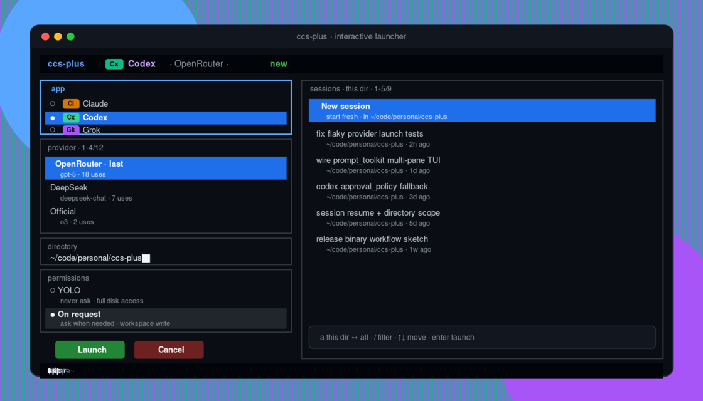

# ccs-plus

<p align="center">
  <strong>cc-switch provider manager · multi-agent CLI launcher · fullscreen TUI</strong><br/>
  <sub>Claude · Codex · Grok · OpenCode — one command, one pane, zero context switching</sub>
</p>

<p align="center">
  
</p>

<p align="center">
  <sub>Interactive launcher — app badges, provider picker, directory-scoped sessions, per-app permission presets</sub>
</p>

---

`ccs-plus` 管理 [cc-switch](https://github.com/farion1231/cc-switch) SQLite 中的 Claude、Codex、Grok、OpenCode provider，并使用选定 provider 启动对应的原生 CLI。

项目只负责 provider 管理、运行配置和 CLI 启动，不实现 cc-switch GUI、本地代理、请求转换或跨 CLI 会话迁移。

## Highlights

| | |
| --- | --- |
| **Fullscreen TUI** | 无参启动进入多面板：App · Provider · Directory · Permissions · Sessions |
| **Session resume** | 按当前目录过滤历史会话；sessions 面板按 `a` 切换全部项目；恢复时使用会话本身的 cwd |
| **Permission presets** | 按 app：Claude permission-mode · Codex YOLO/On request · Grok sandbox · OpenCode allow/ask/deny（± auto） |
| **Provider shortcuts** | `provider list` 显示 `c1` / `x2` / `g1` / `o1`，可用 `ccsp run x2` 一键启动 |
| **Isolated homes** | 每个 app 使用稳定 state home；按配置暴露用户 extensions，不替换真实 Home |
| **Release binaries** | GitHub Release 自动构建 Linux、macOS、Windows 单文件二进制 |

## 安装

### 方式 A：下载二进制（推荐）

发布 [GitHub Release](https://github.com/leoninew/ccs-plus/releases) 后会**自动**构建并上传多平台单文件；无需 Python / uv。

**Linux x86_64**

```bash
curl -fsSL -o ccs-plus \
  "https://github.com/leoninew/ccs-plus/releases/latest/download/ccs-plus-linux-x86_64"
chmod +x ccs-plus
sudo install -m 755 ccs-plus /usr/local/bin/ccs-plus
ccs-plus --help
```

**macOS（Apple Silicon）**

```bash
curl -fsSL -o ccs-plus \
  "https://github.com/leoninew/ccs-plus/releases/latest/download/ccs-plus-macos-arm64"
chmod +x ccs-plus
# 首次运行若被拦截：系统设置 → 隐私与安全性 → 仍要打开
sudo install -m 755 ccs-plus /usr/local/bin/ccs-plus
```

**macOS（Intel）**

```bash
curl -fsSL -o ccs-plus \
  "https://github.com/leoninew/ccs-plus/releases/latest/download/ccs-plus-macos-x86_64"
chmod +x ccs-plus
sudo install -m 755 ccs-plus /usr/local/bin/ccs-plus
```

**Windows（PowerShell）**

```powershell
$dir = "$env:LOCALAPPDATA\ccs-plus"
New-Item -ItemType Directory -Force -Path $dir | Out-Null
Invoke-WebRequest -Uri "https://github.com/leoninew/ccs-plus/releases/latest/download/ccs-plus-windows-x86_64.exe" `
  -OutFile "$dir\ccs-plus.exe"
# 可选：把 $dir 加入用户 PATH
$env:Path = "$dir;$env:Path"
ccs-plus --help
```

**更新到最新版**（覆盖安装即可）：

```bash
# Linux / macOS：重复上面的 curl + install 即可
curl -fsSL -o ccs-plus \
  "https://github.com/leoninew/ccs-plus/releases/latest/download/ccs-plus-linux-x86_64"
sudo install -m 755 ccs-plus /usr/local/bin/ccs-plus
```

```powershell
# Windows：重新下载覆盖
Invoke-WebRequest -Uri "https://github.com/leoninew/ccs-plus/releases/latest/download/ccs-plus-windows-x86_64.exe" `
  -OutFile "$env:LOCALAPPDATA\ccs-plus\ccs-plus.exe"
```

仍需本机已安装要启动的 CLI（`claude` / `codex` / `grok` / `opencode`），并配置好 `settings.yaml` 与 cc-switch 数据库。

### 方式 B：从源码安装（开发）

需要 Python 3.11+、[uv](https://docs.astral.sh/uv/)、可访问的 cc-switch 数据库，以及已安装并位于 `PATH` 中的 `claude`、`codex`、`grok` 或 `opencode` CLI。

```bash
make install
make release
# 或：pip install -e .
```

`make release` 将项目以 editable 方式安装。安装完成后可使用 `ccs-plus` 或其别名 `ccsp` 执行命令：

```bash
ccsp
ccsp provider list
```

### TUI 速查

| 操作 | 按键 |
| --- | --- |
| 切换面板 | `tab` / `s-tab` · `←`/`→`（左栏 ↔ sessions） |
| 列表移动 | `↑↓`、`j/k`、鼠标滚轮 |
| 点选 | 鼠标点击 |
| 过滤 provider / sessions | `/` 后输入 |
| 会话范围 this dir ↔ all | sessions 面板焦点下按 `a` |
| Launch ↔ Cancel | 按钮焦点下 `←`/`→` |
| 启动 / 取消 | `enter`（Launch）· `esc` |
| 数字跳转 | `1`–`9` |

- **New session**：显示可编辑 directory，默认当前目录。
- **Resume**：隐藏 directory，使用会话自身的 cwd。

## 配置

[`settings.yaml`](settings.yaml) 已包含默认数据库路径和运行配置。复制 [`.env.example`](.env.example) 为 `.env`，并将其中的 `CCS_PLUS_ENCRYPTION_KEY` 占位值替换为有效 Fernet key：

```bash
cp .env.example .env
```

生成 Fernet 密钥：

```bash
python -c "from cryptography.fernet import Fernet; print(Fernet.generate_key().decode())"
```

也可用 `.env` 或 `CCS_PLUS_*` 环境变量覆盖配置，嵌套键使用 `__`：

```text
CCS_PLUS_DATABASE__PATH=~/.cc-switch/cc-switch.db
CCS_PLUS_APPS__CODEX__HOME=data/codex
CCS_PLUS_PROXY=http://127.0.0.1:7890
```

只有默认数据库路径不适用时才设置 `CCS_PLUS_DATABASE__PATH`；只有需要代理时才设置 `CCS_PLUS_PROXY`。`proxy` 会写入 Claude、Codex、Grok、OpenCode 子进程的 `HTTP_PROXY`、`HTTPS_PROXY`、`ALL_PROXY` 及小写兼容变量；空字符串会清除父进程继承的代理。不要提交 `.env`、导出的 provider 备份或密钥。

自定义 provider 的 endpoint、API Key、模型和推理强度来自数据库记录。`launch` 的 `--model` 和 `--effort` 仅覆盖本次启动。权限字段优先使用 provider 配置：Claude `permission_mode`、Codex `approval_policy` + `sandbox_mode`、Grok `sandbox_mode` + `always_approve`、OpenCode `permission` + `--auto`；缺失时回退到 `apps.*`。

## 使用

以下示例均在 Bash 中执行，并以 `ccsp` 作为命令入口。

### 命令约定

使用 `ccsp --help` 或任一命令后的 `-h`、`--help` 查看完整参数。`provider`、`launch`、`run` 分别可简写为 `p`、`l`、`r`。

### 管理 provider

#### 1. 查看与复用配置

查看所有 provider：

```bash
ccsp provider list
```

`list --app <app>` 可筛选 Claude、Codex、Grok 或 OpenCode，`--json` 可输出 JSON 元数据。列表中的 Alias 按 app 分组编号，例如 `c1`、`x2`、`g1`、`o1`。

`provider show` 会为名称完全匹配的自定义 provider 先输出带 `--yes` 的 `provider delete`
命令，再输出可复用的 `provider add` 命令。官方 provider 只输出 `add` 命令。默认将 API Key
替换为 `xxxx`：

```bash
ccsp provider show "<provider-name>"
```

执行脱敏命令前需将 `xxxx` 替换为实际密钥。仅在可信终端使用 `--show-secret` 查看原始 API Key。

#### 2. 添加 provider

添加 provider 时，名称、endpoint、API Key 和模型均为必填字段：

```bash
ccsp provider add claude \
  --name "<provider-name>" \
  --endpoint "https://api.example.com/v1" \
  --api-key "<api-key>" \
  --model "<model-id>"
```

```bash
ccsp provider add opencode \
  --name "<provider-name>" \
  --endpoint "https://api.example.com/v1" \
  --api-key "<api-key>" \
  --model "provider-id/model-id"
```

同一 app 内的 provider 名称必须唯一，且名称比较忽略首尾空格和大小写。`--effort` 和 `--notes` 分别设置默认推理等级和备注。

### 启动

直接运行 `ccsp` 可通过 TUI 选择 app、provider、工作目录与会话：

```bash
ccsp
```

也可以按 provider 列表中的编号启动，例如 `x2` 表示第二个 Codex provider，`o1` 表示第一个 OpenCode provider；`launch` 用于启动明确的 provider：

```bash
ccsp run x2
ccsp run o1
ccsp launch codex --provider "<provider-name>"
ccsp launch opencode --provider "<provider-name>"
```

使用 `launch --cwd "<directory>"` 可指定启动目录；`--model` 和 `--effort` 可覆盖本次启动使用的默认模型和推理等级。

### 数据维护

#### 1. 备份

`export` 会备份自定义 provider；省略 app 时涵盖 Claude、Codex、Grok 和 OpenCode：

```bash
ccsp provider export
```

在 `export` 后附加 `claude`、`codex`、`grok` 或 `opencode` 可只备份一个应用，也可指定输出文件。未指定路径时，文件写入 `data/providers-all-<timestamp>.json` 或 `data/providers-<app>-<timestamp>.json`。

#### 2. 恢复

`import` 会恢复备份文件中的所有自定义 provider：

```bash
ccsp provider import "data/providers-all-<timestamp>.json"
```

在 `import` 后附加 `claude`、`codex`、`grok` 或 `opencode` 可只恢复一个应用。恢复时必须配置生成备份时使用的同一个 `encryption_key`。

#### 3. 清理

重置会删除非官方 provider，删除单个 provider 需要显式确认：

```bash
ccsp provider reset
ccsp provider delete claude "<provider-name>" --yes
```

`reset` 省略 app 时会处理 Claude、Codex、Grok 和 OpenCode；附加 app 名可只处理一个应用。该命令默认只预览，传入 `--yes` 才会执行删除。

### 发布与二进制构建

**自动触发：** 在 GitHub 上 **Publish release**（创建并发布带 tag 的 Release，例如 `v0.2.0`）后，Actions 工作流 [`Release binaries`](.github/workflows/release-binaries.yml) 会自动：

1. 在 Linux / macOS arm64 / macOS x86_64 / Windows 上用 PyInstaller 打单文件
2. 将产物挂到该 Release 的 Assets

产物文件名：

| 文件 | 平台 |
| --- | --- |
| `ccs-plus-linux-x86_64` | Linux x86_64 |
| `ccs-plus-macos-arm64` | macOS Apple Silicon |
| `ccs-plus-macos-x86_64` | macOS Intel |
| `ccs-plus-windows-x86_64.exe` | Windows x86_64 |

**手动重跑：** Actions → Release binaries → Run workflow → 填写已有 tag。

**本地自建：**

```bash
make binary    # dist/ccs-plus（Windows: dist/ccs-plus.exe）
```

## 运行模型

每种 CLI 使用配置中的稳定 state home，因此切换 provider 不会替换原生会话目录：

| CLI | 状态目录 | provider 配置方式 |
| --- | --- | --- |
| Claude | `apps.claude.home` | 环境变量 + 稳定 `CLAUDE_CONFIG_DIR` |
| Codex | `apps.codex.home` | 每个 provider 的 ccs-plus managed profile；统一会话 provider 标识 |
| Grok | `apps.grok.home` | managed model profile |
| OpenCode | `apps.opencode.home` | 隔离 `XDG_DATA_HOME` / `XDG_CONFIG_HOME` + `OPENCODE_CONFIG_CONTENT` |

启动时按各 app 的 `visibility` 配置，将必要的用户 extensions 合并或链接进隔离 Home：Claude 的 skills、plugins、MCP；Codex 的 sessions、skills、plugins（包括已注册 plugin 的 cache）与配置扩展；Grok 的 skills、plugins、hooks、installed plugins 与配置扩展；OpenCode 的 skills、plugins、agents、commands、tools、themes。不会将整个用户 Home 直接替换为隔离 Home。Codex 仅隔离 provider 配置、认证和 plugin appserver/install staging 等运行时目录，不保留第二份 plugin 或 skill 内容。

OpenCode 兼容 cc-switch 原生 provider 形状（`npm` / `options.baseURL` / `models`）；DB 无 OpenCode 行时会注入合成 `opencode-official`（本地 auth）。会话从 `share/opencode/opencode.db` 读取。

Claude 默认 `permission_mode` 模板为 `bypassPermissions`。Grok 模板默认 `workspace` + `always_approve`。Codex 新增或导入的 provider 默认使用 `danger-full-access`；已有记录缺少权限字段时回退 `apps.codex`。OpenCode 默认 `permission_mode: allow`、`always_approve: false`。高权限仅应在可信目录和可信 provider 下使用。

## 开发

源码位于 `src/ccs_plus`，测试位于 `tests`。安装依赖后，可用以下命令进行日常开发：

```text
CLI 编排 → settings / domain → database / adapters → launcher
                                      ↘ managed_config / home_visibility / tui
```

```bash
make install       # uv sync --all-groups
make test          # pytest
make check         # ruff + mypy
make binary        # 本地 PyInstaller 单文件
```

### 测试

`make test` 运行完整 pytest 套件。`make check` 执行 Ruff 格式化、Ruff 检查和 MyPy。修改 CLI、配置或 provider 行为时，应同时补充相应测试。测试使用临时 SQLite 与临时 Home，不连接真实用户库。

### 贡献

提交前请运行 `make test` 和 `make check`，保持变更聚焦，并更新受影响的用户文档或 SpecFlow 过程文档。不要提交 API Key、`.env`、用户数据库或 provider 导出文件。

当前规范：本 README 与 [`docs/README.md`](docs/README.md)。`docs/archive/` 为历史材料，仅供追溯，不代表当前实现。
