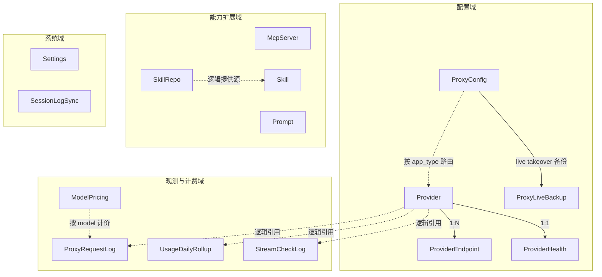
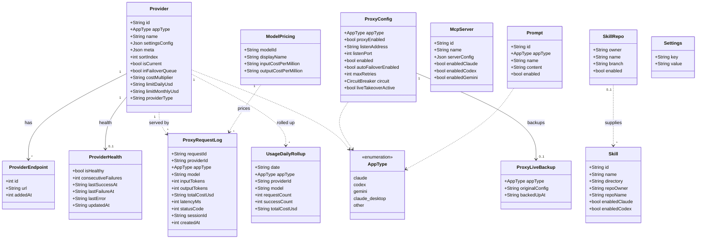
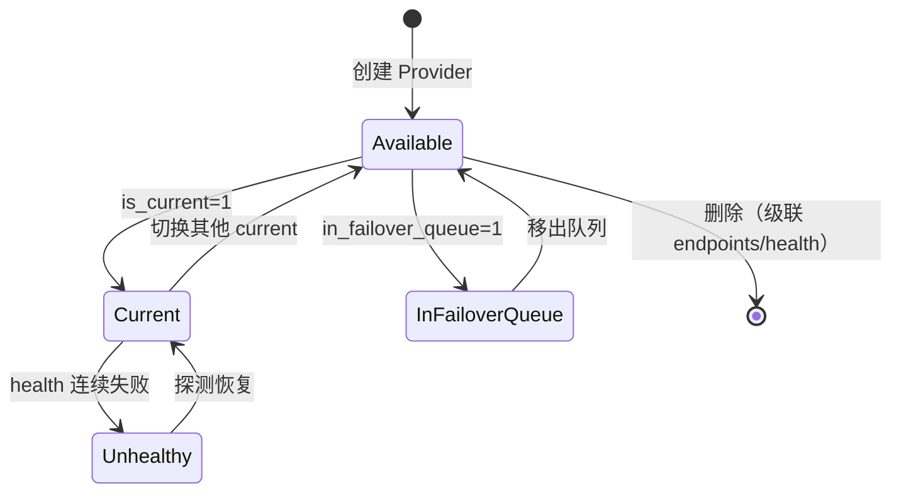
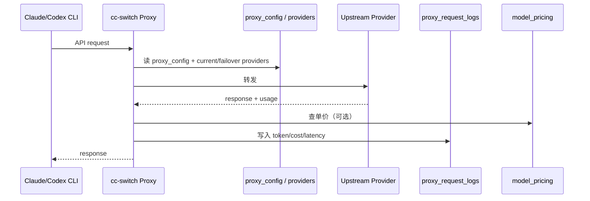
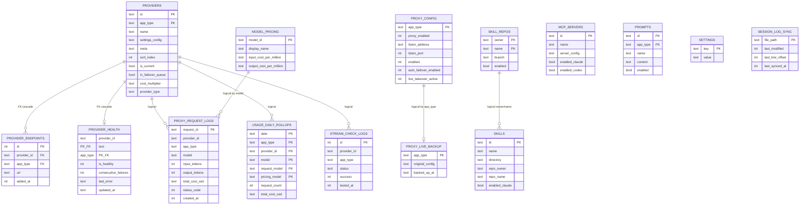
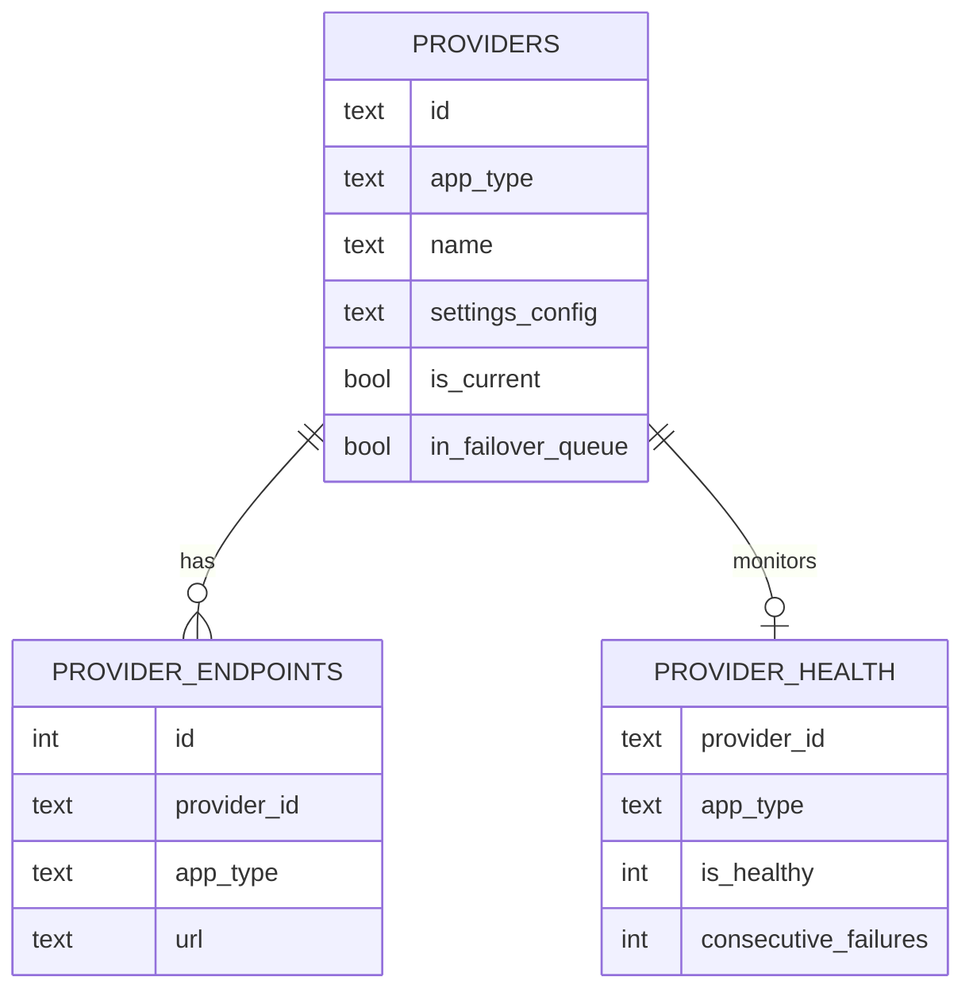
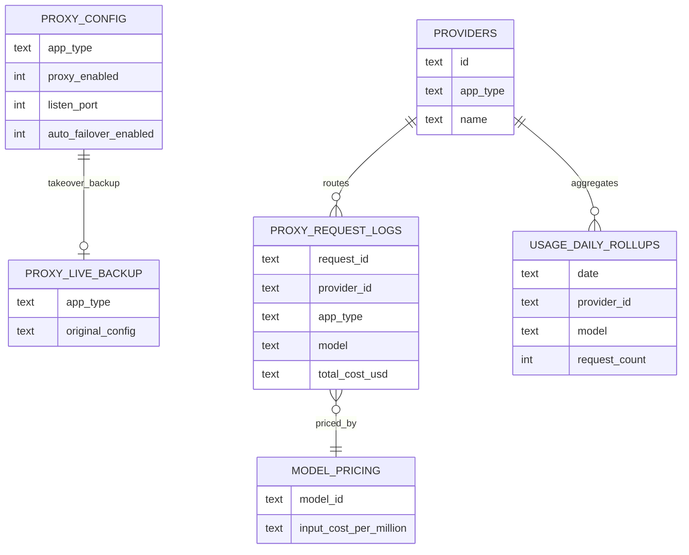

# cc-switch 数据库表结构分析

最后修改时间: 2026-07-19 03:58:22

数据源：`~/.cc-switch/cc-switch.db`（SQLite）  
分析范围：业务表 15 张（不含 `sqlite_*` 系统表）  
说明：部分逻辑外键未在 DDL 中声明；下文 ER 会同时标注 **DDL FK** 与 **逻辑关联**。

---

## 1. 领域建模

### 1.1 业务定位

cc-switch 围绕「**多 App CLI 的供应商（Provider）切换与本地代理（Proxy）**」组织数据：

| 领域 | 核心问题 | 主要表 |
|---|---|---|
| 供应商配置 | 每个 App 有哪些上游、当前用谁、如何 failover | `providers`, `provider_endpoints`, `provider_health` |
| 本地代理 | 是否启用代理、监听地址、超时/熔断/failover | `proxy_config`, `proxy_live_backup` |
| 请求与用量 | 代理请求计量、日汇总、模型单价 | `proxy_request_logs`, `usage_daily_rollups`, `model_pricing` |
| 连通性检测 | 流式探测历史 | `stream_check_logs` |
| 能力扩展 | MCP / Skills / Prompts | `mcp_servers`, `skills`, `skill_repos`, `prompts` |
| 系统设置 | 通用 KV 与 common_config | `settings` |
| 会话同步 | 外部会话日志文件同步进度 | `session_log_sync` |

### 1.2 核心聚合与边界

1. **Provider 聚合（配置主域）**  
   - 根实体：`Provider(id, app_type)`  
   - 子实体：`ProviderEndpoint`、`ProviderHealth`  
   - 值对象（JSON/TEXT）：`settings_config`、`meta`  
   - 状态标志：`is_current`、`in_failover_queue`

2. **Proxy 聚合（运行时路由）**  
   - 按 `app_type` 一行配置（当前 CHECK：`claude` / `codex` / `gemini`）  
   - `proxy_enabled` 决定 CLI launcher 走 direct 还是本地代理  
   - `proxy_live_backup` 保存 live takeover 前的原配置快照

3. **Usage 聚合（观测与计费）**  
   - 事实表：`proxy_request_logs`  
   - 汇总表：`usage_daily_rollups`  
   - 维表：`model_pricing`

4. **Capability 聚合（扩展能力）**  
   - MCP / Skills 以「是否对某 app 启用」布尔列横向展开  
   - Skills 可逻辑关联 `skill_repos(owner, name)`

5. **AppType 贯穿维度**  
   - 几乎所有主业务按 `app_type` 分区  
   - 同一供应商 id 可在不同 app 下各有一份配置（复合主键）

### 1.3 领域关系概览（概念）

### 1.4 与本仓库 launcher 的交集

本仓库 `ccs` 主要读写：

- 读：`providers`、`proxy_config`（list/run）  
- 读写（backup/restore）：`providers`、`provider_endpoints`、`provider_health`、`proxy_config`  

其余表由 cc-switch 主应用/代理维护。

---

## 2. 数据列表

### 2.1 表总览

| # | 表名 | 主键 | 领域 | 说明 |
|---:|---|---|---|---|
| 1 | `providers` | `(id, app_type)` | 配置 | 供应商主表 |
| 2 | `provider_endpoints` | `id` (AUTOINCREMENT) | 配置 | 备用/多 endpoint URL |
| 3 | `provider_health` | `(provider_id, app_type)` | 配置 | 健康与失败计数 |
| 4 | `proxy_config` | `app_type` | 代理 | 本地代理与熔断参数 |
| 5 | `proxy_live_backup` | `app_type` | 代理 | live takeover 原配置备份 |
| 6 | `proxy_request_logs` | `request_id` | 观测 | 请求级日志与费用 |
| 7 | `usage_daily_rollups` | `(date, app_type, provider_id, model, request_model, pricing_model)` | 观测 | 日汇总 |
| 8 | `model_pricing` | `model_id` | 计费 | 模型单价（每百万 token） |
| 9 | `stream_check_logs` | `id` (AUTOINCREMENT) | 观测 | 流式连通性检测 |
| 10 | `mcp_servers` | `id` | 能力 | MCP 服务定义与按 app 启用 |
| 11 | `skills` | `id` | 能力 | Skill 安装与按 app 启用 |
| 12 | `skill_repos` | `(owner, name)` | 能力 | Skill 仓库源 |
| 13 | `prompts` | `(id, app_type)` | 能力 | Prompt 模板 |
| 14 | `settings` | `key` | 系统 | KV 配置 |
| 15 | `session_log_sync` | `file_path` | 系统 | 会话日志同步游标 |

### 2.2 表字段明细

#### `providers`

| 列 | 类型 | 约束 | 含义 |
|---|---|---|---|
| id | TEXT | PK 之一 | 供应商 id |
| app_type | TEXT | PK 之一 | 所属 App（claude/codex/gemini/...） |
| name | TEXT | NOT NULL | 展示名 |
| settings_config | TEXT | NOT NULL | JSON：Claude 偏 `env`；Codex 偏 `auth`+`config` |
| website_url | TEXT | | 官网 |
| category | TEXT | | 分类 |
| created_at | INTEGER | | 创建时间 |
| sort_index | INTEGER | | 列表排序 |
| notes | TEXT | | 备注 |
| icon / icon_color | TEXT | | UI |
| meta | TEXT | NOT NULL DEFAULT `{}` | 扩展 JSON |
| is_current | BOOLEAN | DEFAULT 0 | 是否当前供应商 |
| in_failover_queue | BOOLEAN | DEFAULT 0 | 是否在 failover 队列 |
| cost_multiplier | TEXT | DEFAULT `1.0` | 费用倍率 |
| limit_daily_usd / limit_monthly_usd | TEXT | | 限额 |
| provider_type | TEXT | | 类型标记 |

索引：`idx_providers_failover(app_type, in_failover_queue, sort_index)`

#### `provider_endpoints`

| 列 | 类型 | 约束 | 含义 |
|---|---|---|---|
| id | INTEGER | PK AUTOINCREMENT | 行 id |
| provider_id | TEXT | FK → providers | 供应商 id |
| app_type | TEXT | FK → providers | App |
| url | TEXT | NOT NULL | endpoint URL |
| added_at | INTEGER | | 添加时间 |

DDL：`FOREIGN KEY (provider_id, app_type) REFERENCES providers(id, app_type) ON DELETE CASCADE`

#### `provider_health`

| 列 | 类型 | 约束 | 含义 |
|---|---|---|---|
| provider_id / app_type | TEXT | 复合 PK + FK | 对应 provider |
| is_healthy | INTEGER | DEFAULT 1 | 是否健康 |
| consecutive_failures | INTEGER | DEFAULT 0 | 连续失败 |
| last_success_at / last_failure_at | TEXT | | 时间戳 |
| last_error | TEXT | | 最近错误 |
| updated_at | TEXT | NOT NULL | 更新时间 |

#### `proxy_config`

| 列 | 类型 | 约束 | 含义 |
|---|---|---|---|
| app_type | TEXT | PK，CHECK in (claude,codex,gemini) | 代理作用域 |
| proxy_enabled | INTEGER | DEFAULT 0 | 是否走代理（launcher 关键） |
| listen_address / listen_port | TEXT/INT | 默认 127.0.0.1:15721 | 监听 |
| enable_logging | INTEGER | DEFAULT 1 | 是否记请求日志 |
| enabled | INTEGER | DEFAULT 0 | 代理服务是否启用 |
| auto_failover_enabled | INTEGER | DEFAULT 0 | 自动 failover |
| max_retries | INTEGER | DEFAULT 3 | 重试 |
| streaming_*_timeout / non_streaming_timeout | INTEGER | | 超时 |
| circuit_* | INT/REAL | | 熔断参数 |
| default_cost_multiplier | TEXT | DEFAULT `1` | 默认费用倍率 |
| pricing_model_source | TEXT | DEFAULT `response` | 计价模型来源 |
| created_at / updated_at | TEXT | DEFAULT now | 时间 |
| live_takeover_active | INTEGER | DEFAULT 0 | live takeover 是否激活 |

#### `proxy_live_backup`

| 列 | 类型 | 含义 |
|---|---|---|
| app_type | TEXT PK | App |
| original_config | TEXT | 接管前配置快照 |
| backed_up_at | TEXT | 备份时间 |

#### `proxy_request_logs`

| 列组 | 代表列 | 含义 |
|---|---|---|
| 标识 | request_id, session_id, data_source | 请求与来源 |
| 路由 | provider_id, app_type, provider_type | 命中供应商 |
| 模型 | model, request_model, pricing_model | 模型与计价模型 |
| token | input/output/cache_*_tokens | 用量 |
| 费用 | *_cost_usd, total_cost_usd, cost_multiplier | 金额（TEXT 存十进制） |
| 性能 | latency_ms, first_token_ms, duration_ms | 延迟 |
| 结果 | status_code, error_message, is_streaming | 状态 |
| 时间 | created_at | 创建 |

索引：时间、provider、session、model、status、去重表达式索引等。

#### `usage_daily_rollups`

按日 × app × provider × model 维度汇总 request/success/token/cost/avg_latency。

#### `model_pricing`

| 列 | 含义 |
|---|---|
| model_id / display_name | 模型标识与展示名 |
| input/output/cache_*_cost_per_million | 每百万 token 单价（TEXT） |

#### `stream_check_logs`

探测结果：status/success/message/response_time/http_status/model_used/retry_count/tested_at。  
索引：`(app_type, provider_id, tested_at DESC)`

#### `mcp_servers` / `skills` / `skill_repos` / `prompts`

- MCP/Skills：`enabled_claude|codex|gemini|opencode|hermes` 横向开关  
- Skills 额外：directory、repo_*、content_hash、installed_at/updated_at  
- skill_repos：owner+name 仓库源  
- prompts：按 `(id, app_type)` 存储模板内容

#### `settings` / `session_log_sync`

- settings：通用 KV（常见 key：`common_config_*` 等）  
- session_log_sync：file_path → last_modified / last_line_offset / last_synced_at

### 2.3 索引列表

| 索引 | 表 | 列 |
|---|---|---|
| idx_providers_failover | providers | app_type, in_failover_queue, sort_index |
| idx_request_logs_app_created_at | proxy_request_logs | app_type, created_at DESC |
| idx_request_logs_created_at | proxy_request_logs | created_at |
| idx_request_logs_provider | proxy_request_logs | provider_id, app_type |
| idx_request_logs_session | proxy_request_logs | session_id |
| idx_request_logs_model | proxy_request_logs | model |
| idx_request_logs_status | proxy_request_logs | status_code |
| idx_request_logs_dedup_lookup_expr | proxy_request_logs | 表达式去重查找 |
| idx_stream_check_logs_provider | stream_check_logs | app_type, provider_id, tested_at DESC |

---

## 3. 关键 UML

### 3.1 领域类图（配置 + 代理 + 观测核心）

### 3.2 供应商配置状态（简化）

### 3.3 请求处理与计费协作（序列概念）

---

## 4. 关键 ER 图

### 4.1 全库关系（DDL FK + 逻辑 FK）

实线：DDL 声明外键；虚线注释：逻辑关联（应用层维护，无 FK）。

### 4.2 供应商配置子图（强一致核心）

### 4.3 代理与用量子图

---

## 5. 设计要点与约束

1. **复合主键 `(id, app_type)`**  
   同一供应商标识可跨 App 独立配置；所有强 FK 都携带 `app_type`。

2. **金额用 TEXT**  
   `*_usd`、单价、倍率多为 TEXT，避免浮点误差；应用层按十进制解析。

3. **settings_config 形态因 App 而异**  
   - Claude：`env`（`ANTHROPIC_*`）、plugins、model 等  
   - Codex：`auth` + `config`（TOML 字符串）  
   - Gemini：`config` + `env`

4. **日志无 FK 是有意松耦合**  
   删除 provider 后历史日志可保留孤儿 `provider_id`，利于审计；汇总表同理。

5. **proxy_config.app_type CHECK 较窄**  
   目前仅 `claude|codex|gemini`；`providers.app_type` 可更宽（如 `claude-desktop`）。

6. **能力表横向布尔列**  
   `enabled_*` 随支持的 CLI 扩展（opencode/hermes 等），演进时靠加列而非关联表。

---

## 6. 与 ccs backup/restore 的映射

| 操作 | 涉及表 |
|---|---|
| `ccs backup` 导出 | `providers`, `provider_endpoints`, `provider_health`, `proxy_config` |
| `ccs restore` 覆盖 | 同上四表（事务内全量替换） |
| 不导出 | 日志、用量、MCP、skills、prompts、settings、pricing 等 |

---

## 7. 参考

- 本地 DB：`sqlite://~/.cc-switch/cc-switch.db`  
- 本仓库 launcher：`src/cc_switch/cli.py`  
- 查询工具：`pomelo-db -d cc-switch`
